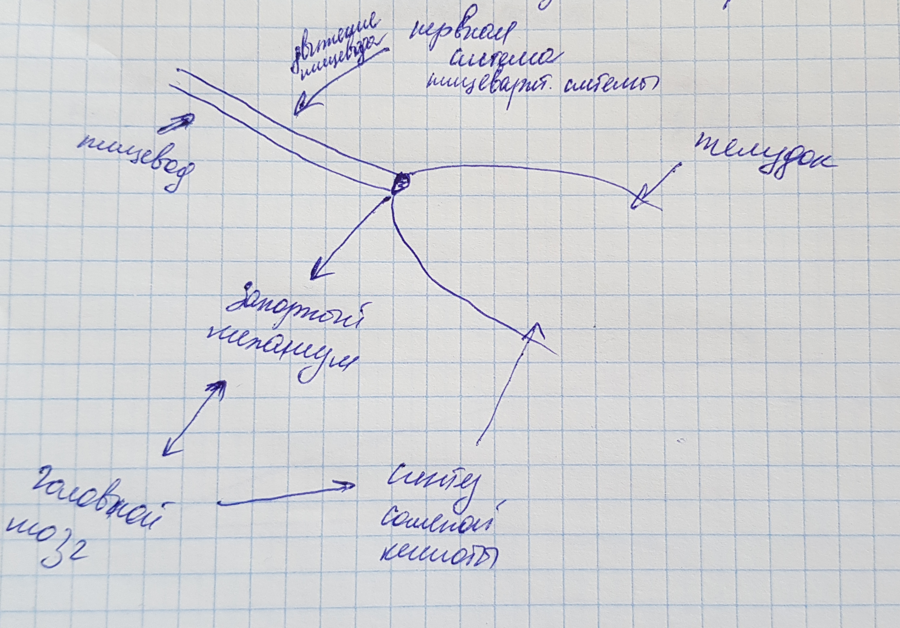

# Очаровательный кишечник

## Пища

### Углеводы

Хлеб, макароны, рис — всё это цепи молекул глюкозы.

* чем длиннее цепи молекул глюкозы в пище, тем медленнее обрабатывается пища в кишечнике
* то, что обрабатывается быстро, называется "сахарной бомбой"
    * приводит к выбросу гормона инсулина
        * быстрее появляется ощущение усталости, голода
    
* сахар моментально всасывается в кровь, поступая в тонки кишечник
* большое количество чистого сахара быстро и на продолжительное время делает кровь сладкой
* мозг - "губка" для сахара в крови
* сахар нужен мозгу, т.к. легок в обработке и быстрее превращается в энергию, глюкоза - единственное вещество,
  которое с минимальными энергозатратами синтезируется в жиры
    * активизирует центры поощрения
        * положительные эмоции
    * организм запасает всю глюкозу, не пропуская ни молекулы
        * гликоген в печени
            * расходуется при кратковременных нагрузках (пробежка)
        * жир в жировой ткани
            * расходуется при интенсивных нагрузках (темп / время, измеряется частотой сердцебиения)
            * самая ценная и эффективная субстванция из всех питательных веществ
            * формирует оболочки нервных волокон (по типу изоляции для электропроводов)
            * входит в состав мембран клеток
            * влияет на скорость генерации мыслей
    

1 бутерброд = 1-2 чайные ложки сахара

Пищеварительные энзимы – это специфичные белки, ускоряют реакции в организме человека

### Жиры

Путь жиров в организме:
* тонкий кишечник
    * лимфатическая система (для каждого сосуда крови существует сосуд лимфатической системы)
    * грудной проток (собирает жиры)
        * брюшная полость — путь отсюда и до сердца идёт мимо печени, то есть не подвергается фильтрации
            * диафрагма 
                * вена 
                    * сердце - [и кровь] беззащитны перед действием "плохих" жиров
                        * кровь (сосуды)
                            * печень
    
При жарке не твёрдых масел под воздействием температуры связываются стабильные радикалы, которые, попадая в кровь
вызвают закупорку сосудов сердца и крови.  Поэтому для жарки лучше использовать твёрдые масла (сливочное, кокосовое),
т.к. они устойчивы к воздействию температуры.
Растительное масло содержит в своём составе *олеокантал* (особенно
им богато оливковое масло), регулярное употребление в пищу которого есть профилактика головных болей, воспалений, болей
менструации.

Суточная норма жиров ± 55-60 г/сутки (в сумме растительных и животных).
Например, 1 бигмак это примерно 30г жиров (не самых хороших).

Виды жиров по происхождению:
* животные
    * арахидоновая кислота
        * содержат больше воспалительного компонента (содейтсвуют воспалениям в организме)
* растительные
    * альфа-линолевая кислота
        * содержат больше противовоспалительного компонента (содейтсвуют противовоспалительным процессам в организме)

### Белки

Состоят из **аминоксилот**, которые в свою очередь:
* собираются в цепочки разной длины
    * именно цепочки разной длины представляют собой разнообразие вкусов еды
    * разбираются из протеинов и всасываются в тонком кишечнике
    * по происхождению
        * животного: мясо, рыба, молоко
        * растительного: бобы, соя, фасоль, гречка
    
Скорость усвоения белка зависит от его типа.

## Аллергии и непереносимости

#### Пищевая аллергия на продукты, содержащие белки и жиры одновременно

Мезанизм аллергии:
* тонкий кишечник
    * нерасщепленные обрывки протеиновых цепей + капли жира
        * [попадают в] лимфатическая жидкость
            * [привлекая внимание] имунные клетки, потому что лимфа только для белков!
                * [что вызывает] аллергическая реакция: отёки лица, языка
    
#### Целиакия

[Целиакия](https://ru.wikipedia.org/wiki/%D0%A6%D0%B5%D0%BB%D0%B8%D0%B0%D0%BA%D0%B8%D1%8F) (глютеновая энтеропатия, кишечный инфантилизм, болезнь Джи-Гертера-Гейбнера) — патологическое нарушение работы кишечника, при котором наблюдается непереносимость глютена. Этот белок находится в злаковых культурах.

Механизм:
* проницаемость стенки тонкого кишечника (отклонение от нормы в худшую сторону)
    * обрывки пищевых молекул попадают в кровоток
        * аллергическая реакция 
            * сильная воспалительная реакция
                * разрушаются ворсинки слизистой тонкого кишечника
                * поражается нервная система
    

##### Группы крови

| O(I) | A(II) | B(III) | AB(IV) |
| ---- |:-----:| ------:| ------:|

#### Непереносимость лактозы

**<ins>НЕ ЕСТЬ АЛЛЕРГИЯ НА МОЛОКО!</ins>** 
Самое тяжелое последствие аллергии на молоко – смерть,  
непереносимости лактозы – нарушение пищеварения, отравление.

Лактоза — молекула, состоящая из двух звеньев.  
* фермент для её расщепления не поставляется в тонкий кишечник, а
синтезируется в нём
    * при отсутствии/нехватке фермента лактоза не всасывается в кровь
        * тем самым отправляясь в полость толстой кишки, где является
            * пищей для бактерий, продуцирующих газ(ы)
                * отсюда *диарея*
                * *вздутие*
    
Лакт**А**за — это фермент из семейства β-галактозидаз, лактаза гидролизует гликозидные связи и принимает участие 
в гидролизе дисахарида лактозы. В результате гидролиза одной молекулы лактозы образуется молекула галактозы и глюкозы.    
    
В целом неперносимость лактозы есть шкала: 
[полная непереносимость лактозы, ..., 0, ..., полная переносимость лактозы]

С возрастом в человеческом организме отключается ген, ответственный за процессы переваривания лактозы. Такое явление 
наблюдается по некоторым оценкам у ±75% населения.

Непереносимость [чего-либо] – [может быть] реакция организма на необходимость перестройки на другую систему питания.

#### Непереносимость фруктозы

При непереносимости выводится через толстую кишку, что ведёт к 
* потеря триптофана
    * являющегося "строителем" серотонина
        * ведёт к недостаточности поступления серотонина в организм
            * депрессия

Серотонин, в том числе, формирует чувство удовольствия от насыщения.
E300 (на маркировках) - есть не что иное, как витамин C в составе продукта.

Необходимые 50 грамм фруктозы в сутки — это (±) (одно из): 

| 5 груш | 8 бананов | 6 яблок |
| ------ |:---------:| -------:|

## Небольшая лекция на тему «Кал» 

> **Кал ≠ То, что было съедено**

75 % каловых масс = вода (± 100 мл/ сутки) 

#### Твёрдая часть кала

33% – бактерии [ЖКТ], выработавшие свой ресурс 
33% – неперевариваемые растительные волокна (клетчатка) 
33% – компоненты метаболизма, в том числе остатки медикаментов, красителей, холестерина

#### Цвет
Естественный цвет – коричневый, жёлто-коричневый

Красные клетки крови – эритроциты

    * при утилизации распадается красный пигмент
        * зеленеет
            * желтеет
                * отсюда цвет мочи
                * попадает в печень
                    * оттуда в полость кишечника
                        * обрабатывается бактериями
                            * после и в процессе обработки становится коричневым

Гамма цветов кала и их причинность:
* от светло-коричневого до желтого
    - синдром [Жельбера-Мейленграхта](https://ru.wikipedia.org/wiki/%D0%A1%D0%B8%D0%BD%D0%B4%D1%80%D0%BE%D0%BC_%D0%96%D0%B8%D0%BB%D1%8C%D0%B1%D0%B5%D1%80%D0%B0)
    - результат приёма антибиотиков, диарея
* от светло-коричневого до серого
    - закупорка протоков (пережим/перекрутка)
    - с данным синдромом необходимо обращаться к врачу
* чёрный или красный (кроме приёма в пищу красной свеклы накануне)
    - кровь в стуле
        - геморрой
        - ...
    - с данным синдромом необходимо обращаться к врачу
    

#### Консистенция

[Бристольская шкала классификации форм](https://en.wikipedia.org/wiki/Bristol_stool_scale) кала выделяет 7 типов.
Тип кала может указывать на время прохождения каловых масс по полости кишечника.
При запорах каловые массы могут двигаться по кишечнику в течение 100 и более часов, при диарее - 7 часов.
Норма ± 16 часов (но это не точно).

**CONSTIPATION** – запор 
**FIBRE** – клетчатка

#### Поза или как правильно сидеть на унитазе

Обратите внимание на две верхние картинки – на них показано положение мышцы, которая охватывает толстый кишечник, а так
же показаны позы, когда хватка этой мышцы ослаблена за счет поднятия уровня ног. От перенапряжения во время опорожнения 
могут развиваться варикозы, подниматься давление.

##### При запорах

## Нервная система кишечника

Стенки кровеносных сосудов сформированы гладкомышечной оболочкой
* гладкомышечная  мускулатора
    * эмоция "стыд"
        * мускулатура растягивается, сосудики лица расширяются
    * стресс 
        * мускулатура сокращается, сосудики сужаются, растёт давление
* стенка кишечника состоит из 3х слоёв гладкомышечной мускулатуры

Нервная система кишечника
* автономна от ЦНС
* невозможно её сознательно контролировать (отрыжка, газы)
* продолжает работать, даже если/когда ноги/легкие перестали работать

### Движение пищи в организме

<b>Глаза:</b> 

Пища :cake:  
↓ (отражает свет) 
Свет 
↓ 
Глаза :eyes:  
↓ 
Активируются зрительные нервы 
↓ (информация) 
Мозг :brain:  
↓ 
Кора головного мозга 
↓ 
Формируется картинка (только сейчас мы видим пищу) 
↓ (сигналы) 
* станция слюноотделения
    * ротовая полость
        * слюна
* желудок
    * синтез соляной кислоты
    

<b>Нос:</b> 

Запахи 
↓ 
Ароматические молекулы пищи 
↓ 
Растворение в слизи носа 
↓ 
Обонятельный нерв

<b>РОТ:</b> 
* мускулатура нижней челюсти – самая сильная мышца организма 
* самая подвижная поперечно-полосатая мышца – язык
* зубная эмаль – самый прочный и твердый материал, синтезируемый человеческим организмом

Пища 
↓ 
Рот 
↓ 
* дробление на мелкие частицы 
* смешение пищи со слюной
    * ускоряет процесс её обработки 
    
↓ 
Процесс жевания пищи 
↓ 

<b>ГЛОТКА</b> 
↓ 
Перекрывается сообщение с носовой полостью 
↓ 
Пищевой комок перемещается в глотку 
↓ 

<b>ПИЩЕВОД</b> 
↓ 
Совершает волнообразное движение 
↓ 
Сначала расширяется перед комком пищи, чтобы пропустить её 
↓ 
Замыкается за комком пищи, чтобы протолкнуть её 
↓ 
Движение только в одну сторону (предыдущие 3 пункта – пропульсивное перистальческое движение) 
↓ 
Расслабляется кольцевая мускулатура перед желудком 
↓ 
Пища попадает в желудок 
↓ 
Обратно идёт команда "можно дышать" 
↓ 
...

#### Путь от рта к желудку

Периферическая нервная система (работает осознанно, подконтрольно)
Автономная нервная система (работает неосознанно)

* 600-2000 глотательных движений в день
* 20 пар мышц задействованы

... 
↓ 
<b>ЖЕЛУДОК</b> 
* может растягиваться на весь объем поступающей пищи
    * страх/стресс могут затруднить растяжение
        * насыщение происходит быстрее при малых объемах пищи
    
↓ 
Пища 
↓ 
Желудок расслабляется 
↓ 
Интенсивно сокращается и расслабляется (~ 2 часа на кусок торта, ~ 6 часов на стейк) 
↓ 
Передает импульсы движения кишечному тракту 
* содержимое кишечника движется "к выходу"

Измельчает пищу 
↓ 
Пища попадает вниз, к привартнику желудка 
↓ 
Попадает в двенадцатиперстную кишку (начальный отдел тонкого кишечника) 
↓ 
...

#### Тонкий кишечник

Пища 
↓ 
Привратник желудка 
↓ 
12-перстная кишка 
↓ 
<b>ПИЩЕВАРЕНИЕ</b> (происходит тут) 
↓ 
Месиво из пищи распределяется по стенкам
* колышутся ворсинки, поглощая и двигая месиво вперёд 

↓ 
Перистатильческий рефлекс 
↓ 
Толстый кишечник 
↓ 
"Уборка" в тонком кишечнике (мигрирующий моторный комплекс) 
* урчание в животе (результат работы "маленьких уборщиков") 
* шум/громкость зависит от количества воздуха, попавшего в тонкий кишечник

↓ 
Жевание останавливает процесс "уборки" 
↓ 
Нужно делать паузы между приемами пищи
* 2-3 часа между перекусами
* 4-5 часов между приемами пищи
* 10-11 часов между ужином и завтраком 
↓ 
...
  

#### Толстый кишечник

* родина кишечной микрофлоры, которая обрабатывает непереваренную ранее пищу

Пища 
↓ 
Баугиниева заслонка (конец тонкого кшиечника) 
↓ 
Толстый кишечник
* работает несуетливо
* в него попадают в основном пищеварительные соки 
* имеет контуры жемчужного ожерелья
    * в процессе перемещения пищи образует ямки, чтобы формировать комки
        * 3-4 раза в день продвигает упакованные массы вперёд
    
↓ 
Пищеварительные соки всасываются в кровеносное русло 
* сильный испуг может остановить этот процесс, что вызовет диарею
* компенсация жидкости, потраченной на предыдущие этапы пищеварения

<b>Чем спокойнее человек, тем более слаженно и гармонично работает его кишечник!</b>

Весь процесс пищеварения занимает от 24 часов до 3 суток. Большая часть этого времени приходится на толстый кишечник.

2-3 литра пищи в сутки → 150-250 грамм кала

### Изжога и отрыжка кислым

Гладкая мускулатура желудка
* совершает двигательные ошибки
    * может выделяться соляная кислота
        * при попадании в полость пищевода до начальных его отделов, без попадания в глотку – изжога
        * при отрыжке прорывается в полость глотки
        * при контакте с не предназначенными для контакта с ней местами (в организме) возникает ощущение "жжения"
    
Причина – сбои в деятельности нервной системы

Техники расслабления (медитация, дыхательные техники) подавляют формирование хаотичных сигналов в мозге
* четче нервные сигналы в организме
    * смыкание циркулярной мускулатуры
        * курение/повышенный уровень гормонов вредит этому механизму, расслабляя мускулатуру
    * снижение синтеза соляной кислоты
        * глутамат приводит к увеличению синтеза соляной кислоты
    
Соляная кислота:
* нейтрализует аллергию и бактерии
* помогает в процессе переваривания белков

### Рвота

Рвота – есть сложный рефлекторный акт, осуществляющийся с участием рвотного центра (мозг), координирующего все  
двигательные реакции.
* внезапная, обильная – вирус (причина)
* тошнота до, обильная – инфекция (отравление испорченными продуктами, алкоголем)

Тошнота свидетельствует о том, что еда не пошла нам на пользу.

Механизмы рвоты:
* рассинхронизация между сигналами от глаз и от органов равновесия
* повышенное содержание в крови гормонов стресса
    * гормоны стресса выделяются в мозге и ЖКТ
    
Рвота <u>по сигналам от мозга</u> направлена на сохранение энергии организма путем избавления его от задачи 
переваривания пищи для возможной предстоящей стрессовой ситуации.
Рвота <u>по сигналам от кишечника</u> – пища была отравлена, условия для переваривания неблагоприятные.

➡ Подавление синтеза гистамина на уровне головного мозга ведет к вялости и усталости.

### Запоры

<u>Ритуал</u> акта дефекации нужно проводить в расслабленном и спокойном состоянии в тихом укромном месте.

Запор – первый признак неправильного [образа] питания.

Причины:
* неправильное питание
* недостаточно жидкости (менее 2.5 литров в сутки)
* неправильное сочетание продуктов питания
* несоблюдение естественных физиологических циклов
* психоэмоциональные факторы

Решения (долгосрочные):
* больше клетчатки (семена подорожника, слива / балластные вещества из аптеки)
* увеличить объем потребляемой жидкости, если потребляется мало
* ходить в туалет при позывах, иначе нарушается рефлекс прямой кишки на растяжение
* прОбиотики и прЕбиотики
* дополнительные прогулки, если их стало меньше и появились запоры
* интенсивные занятия спортом
* раскачивание на унитазе (картинка выше)
* посещение врача, если причины неизвестны

### Слабительные препараты

* на основе осмоса
    * на основе соли
        * внезапный эффект
        * нарушают водно-солевой баланс организма
    * на основе сахара
        * лактоза
            * синтезируется из молочного сахара
            * метеоризм, вздутия
        * сорбит
            * диарея
            * груша, яблоко, слива
    * короткие молекулярные цепочки
        * ПЭГ (3350)
            * без обнаруженных побочек
    
### Смазка для кала (масляные слабительные)

* при длительном применении могут выводить из организма значительное количество жирорастворимых витаминов: A, D, E, K
* применяются как временное средство при заболеваниях

Гидратанты:
* эффект основан на мощном стимулировании кишечника
* есть свечи на их основе, эффект в течение часа
* борьба с запорами по причине медлительных нервов
* прием не более 2-3 дней, т.к. приводят к перевозбуждению нервов

Прокинетики:
* работают по принципу рупора
* пока ещё ведутся испытания этих препаратов

<b>ПРАВИЛО 3-х ДНЕЙ:</b> 
После приёма слабительного опорожняется <u>весь</u> кишечник, поэтому следующий акт дефекации произойдет где-то через 
3-е суток – это время, необходимое для того, чтобы наполнился последний отдел кишечника.

### О влиянии кишечника на работу головного мозга

* память напрямую зависит от работы кишечника
* <u>блуждающий нерв</u> является своеобразным телефонным проводом,  
  соединяющим кишечник с отдельными центрами головного мозга
* кишечник является гигантской матрицей, регистрирующей состояние нашей внутренней среды  
  и находится под контролем бессознательного
* <u>кишечник</u> продолжает функционировать, когда отсутствует связь с головным и спинным мозгом,  
  т.о. самостоятельно решает все проблемы пищеварения на всём протяжении ЖКТ
* <u>кишечник</u> и головной мозг работают в дуэте уже на самых ранних этапах развития человека
* <u>кишечник</u>, который плохо себя чувствует – опосредованно влияет на состояние головоного мозга,  
 а здоровый, нормально функционирующий – формирует исключительно хорошее настроение.
  
### Синдром раздраженного кишечника, стрессы и депрессии

Кишечник 
⭣(сигнал) 
Блуждающий нерв 
⭣(сигнал) 
Таламус (своего рода face control для поступающих сигналов) 
⭣(прошедший сигнал) 
Головной мозг 
⭣ 
Сознание

Симптомы:
* боль/ дискомфорт/ вздутие живота
* чередование редкого и частого стула, изменение его консистенции, резкие позывы на дефекацию
* тошнтоа, ощущение кома в горле при глотании пищи
* в редких случаях – спазм суставов или мышц, головные боли, тревожность, депрессия

Возможные причины:
* продолжительные частые микровоспаления
* нарушения микрофлоры
* скрытые пищевые непереносимости
* стресс

<u>ПРАВИЛО ПРИЁМА ПИЩИ:</u> 
Никаких перегрузок, никакой спешки,  
Тихая спокойная обстановка

Психотерапия – физкультура для нервов

## Мир микробов

<u>Микрофлора</u> - совокупность всех организмов, обитающих в нашем теле как снаружи, так и внутри  
и 99% её составляет кишечная микрофлора.

Почтие все запахи человека – результат работы (жизнедеятельности) бактерий.

> А что, если мы – микроскопическая часть микрофлоры некоего титанического вещества?

В 1 кг кала численность бактерий выше, чем численность населения нашей планеты.

Микрофлора кишечника – ~ 2кг, 100 милиардов микроорганизмов.

Микроорганизмы:
* расщепляют непереваренную пищу, снабжая организм энергией
* синтезируют витамины
* нейтрализуют яды / остатки медикаментов
* тренируют имунную систему
* вызывают понос
* синтезируют вещества, кислоты, газы, жиры

Изменения микрофлоры ведут к изменениям в организме.

⟶ 'Микрофлора' как название появилось потому, что раньше бактерии относили к растениям.  
Правильнее было бы говорить "М И К Р О Б И О М".

В полости кишечника свыше 1000 штаммов микроорганизмов, а так же присутствуют вирусы, грибы и различные одноклеточные.
80% имунной системы представлено в кишечнике.

<u>Иммунитет</u> - (lat) невосприимчивость. 
Имунные клетки уничтожают эритроциты (клетки крови) другой группы, потому что на их поверхности есть схожие с клеточной 
мембраной бактерий протеиновые молекулы, не знакомые нашему иммунитету, а следовательно – потенциально опасные.

Группа крови напрямую взаимосвязана с кишечной микрофлорой, это один из <u>иммунологических феноменов</u>, т.к.  
иммунитет напрямую зависит от состояния микрофлоры кишечника.

> Состав микрофлоры человека уникален, это некий GUID

### Формирование микрофлоры кишечника

Малыш во внутриутробном периоде стерильнее, чем помещение операционной после тщательной обработки. 

Ребенок рождается → Вагинальная + кишечная микрофлора → Микроорганизмы кожного покрова → Микроорганизмы больницы

~ 3 года на формирование флоры кишечника.

<u>Материнское молоко</u> – самый сбалансированный продукт, позволяющий сформировать нормальную микрофлору кишечника  
у ребёнка с первых дней его жизни.

Запах(и) изо рта/ боли живот у новорожденного могут быть признаком того, что его микрофлора ещё не сформировалась.

Формирование микрофлоры:
* брожение
    * углеводы
        * уксусная кислота 
        * молочная кислота
* гниение

В норме если эти процессы происходит равное количество времени.

→ У однояйцевых близнецов разный состав бактерий организма. 
→ Ценные бактерии могут передаваться по наследству. 
→ Кесарево сечение не даёт младенцу возможности "заразиться" полезной микрофлорой.  
Таким детям лучше принимать лактобактерии.

Негативные факторы для кишечной микрофлоры:
* несбалансированное питание
* бесконтрольный приём антибиотиков
* избыточная дезинфекция
* частый контакт с патогенными микроорганизмами

### Микрофлора кишечника взрослого человека.

Человек и микрофлора его кишечника способны влиять друг на друга.

Биология изучает
* неживое
* живое
    * археи
    * бактерии
    * эукариоты
        * амёбозои
            * существа передвигающиеся при помощи псевдоподий
        * водоросли
        * простейшие (протисты)
        * растения
        * опистоконты
            * животные
            * люди
            * грибы
                * дрожжи
    
Кишечная микрофлора:
* сообщества бактерий
    * Bacteroides
    * Firmicutes
        * Lactobacterium
    * Proteobacteria
        * Helicobacter
    * Actionobacteria
    * Verrucomicrobia
    
90% микрофлоры кишечника – бактерии.  
Количество микроорганизмов кишечника > Количество клеток организма человека

Советы по питанию:
* всегда тщательно пережевывать пищу [медитация, молитва перед едой]
* кушать в покое (не устал, не напряжен, не холодные руки или стопы – тогда кровоснабжение кишечника хуже)
* есть только при чувстве голода

### Генофонд бактерий

У кишечных бактерий в 150 раз больше генов, чем у человека.  
По микрофлоре можно составить портрет человека.

1 бактерия ~ 1000 генов.

Три типа кишечника (по преобладанию семейства бактерий):
* Bacteroides
    * влияют на вес человека
    * основная задача – получение энергии
    * похоже, что любят мясо и насыщенные жирные кислоты
    * такой тип кишечника синтезирует много биотина (витамин Н), нейтрализующего яд сырого белка
* Prevotella
    * в процессе работы выделяют соединения серы
    * синтез В1 – тиамина (для нервных клеток и оболочек нервных молекул)
* Ruminococcus
    * предположительно питаются растительными волокнами
    * синтезируют гем (группы белков), который нужен для синтеза элементов крови
    
### Роль микрофлоры

Влияние на избыточный вес
* дисбаланс состава микрофлоры
* сублкиническое воспаление
    * затрудняется функция щитовидной железы
        * тормозится сжигание жиров
* бактерии способны управлять аппетитом человека и различать пищу

### Холестерин и микрофлора кишечника

Холестерин: chol (желчь) + stereos (твердый)

Желчь в человеческом организме является транспортным средством для жиров и холестерина.

Бактерии синтезируют:
* пропионат
    * блокируют производство холестерина
* ацетат
    * стимулируют производство холестерина
    
Холестерин необходим для нормальной деятельности нервной системы.

### Вредители: плохие бактерии и паразиты.

<b>Сальмонеллы</b>
* 9 видов
* более 1000 разновидностей
* более 2 лет жизни во внешней среде (в фекалиях)
* умирают при +75 градусах Цельсия от 10 минут и выше
* типичный представитель микрофлоры рептилий
* при диарее
    * тщательная обработка кипятком всех приборов
    * термическая обработка продуктов питания
    * покупка яиц хранящихся при температуре ниже +10 градусов Цельсия
* симптомы
    * рвота
    * понос
    * температура
    * слабость 
    * зеленоватый цвет фекалий с характерным отвратительным запахом
    
<b>Хеликобактер пилори</b>
* 50000 лет в организме человека
* типы
    * 3 африканских
    * 2 азиатских
    * 1 европейский
* всегда приспасабливается к своему хосту и развивается вместе с ним
* лекарство
    * антибиотики
    * брокколои (лучше ростки)
* может воздействовать как позитивно, так и негативно на человека

<u>Сублимация</u> – процесс перехода из твердого состояния в газ без жидкой фазы.

<b>Токсоплазма</b>
* особено опасно попадние в организм беременной
* ухудшение настроения
* депрессии
* приступы апатии
* способна влиять на формирование страха, обаняние и поведение человека

<b>Острицы</b>
* разновидность глистов
* вызывают бессонницу, отсутствие концентрации, повышенную чувствительность
* раздражение кишечника, запоры, поносы, боли в животе, головные боли, тошнота
* чёс анального отверстия по ночам, т.к. острицы знают, когда человек спит, тем самым, почесавший пальцами человек 
будет разносить их яйца около лица, вновь подвергая человека заражению
  
### О чистоте и хороших бактериях
1. <u>Разбавление</u>: мытьё овощей и фруктов, проветривание помещений. 
Губки для мытья посуды – самые грязные вещи в доме, нужно чаще менять. 
Посуду споласкивать проточной водой после мытья.   
2. <u>Осушение</u>: на сухих поверхностях бактерии не способны к размножению, многие погибают. 
3. <u>Высокая температура</u>: стирать бельё при температуре от 60 градусов Цельсия и выше. 
Зима – лучшее время для чистки от бактерий.
4. <u>Очистка</u>: мутьё рук, тела (не редкое, не частое).

<u><b>ЧИСТОТА</b></u> не то же самое, что и <u><b>СТЕРИЛЬНОСТЬ</b></u>.
<u><b>ЧИСТОТА</b></u> – разумный баланс большого количества хороших бактерий и небольшого количества плохих.

### Антибиотики

2 механизма:
* бактерицидный
    * уничтожение бактерий
    * быстрый эффект
* бактериостатический
    * препятствие размножению бактерий
    
Антибиотики бессильны при большинстве простуд.

Тест на <u><b>прокальциотин</b></u> показывает природу заболевания – бактериальную или вирусную.

* Не принимать без серьёзных показаний
* Покупать биомясо
    * сокращая издержки на оборудование и содержание помещений для скота/птицы, который будет забит на мясо 
    компании кормят их антибиотиками, что позволяет им не болеть и не умирать в условиях антисанитарии.
* Тщательно мыть овощи и фрукты

Целесообразны при:
* воспаление лёгких
* ангина
* гнойный отит
* гайморит
* пиелонефрит

### Пробиотики

Продукты брожения – "пища будущего". 
Ферментация – процесс обработки питательных веществ бактериями.

Пробиотики:
* массаж и бальзам для кишечника
    * синтез бутирата
* охранный сервис
    * уничтожение чужеродных бактерий
    * формирование кислой среды в кишечнике
* хорошие консультанты и тренеры в вопросах о бактериях
* стимулируют работу имунной системы
* эффективны от диареи
* могут защищать от аллергии
    * ослабляют симптомы проявления аллергии
    
Сахаромицет Буларди – гриб (полезный), не подвержен действию антибиотиков.

### Пребиотики

Вещества, стимулирующие рост и жизнедеятельность полезной микрофлоры кишечника.

<u><b>Цикорий</b></u>

Употребление пробиотиков снижает риск развития онкологии.
