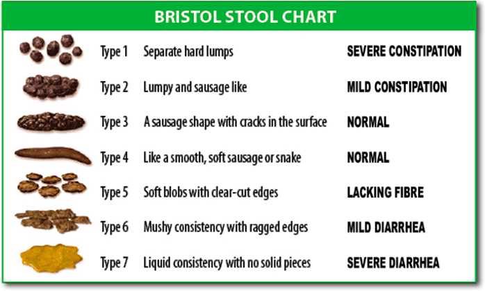
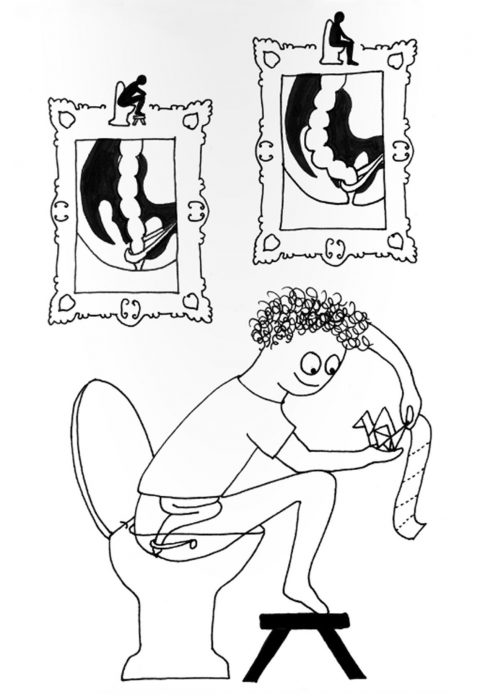
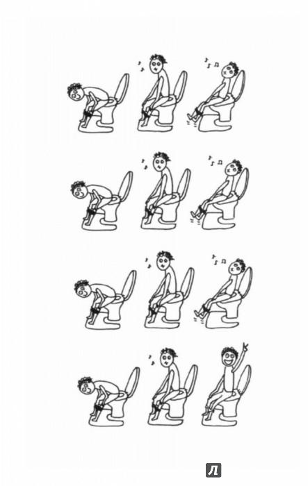

# Очаровательный кишечник

## Пища

### Углеводы

Хлеб, макароны, рис — всё это цепи молекул глюкозы.

* чем длиннее цепи молекул глюкозы в пище, тем медленнее обрабатывается пища в кишечнике
* то, что обрабатывается быстро, называется "сахарной бомбой"
    * приводит к выбросу гормона инсулина
        * быстрее появляется ощущение усталости, голода
    
* сахар моментально всасывается в кровь, поступая в тонки кишечник
* большое количество чистого сахара быстро и на продолжительное время делает кровь сладкой
* мозг - "губка" для сахара в крови
* сахар нужен мозгу, т.к. легок в обработке и быстрее превращается в энергию, глюкоза - единственное вещество,
  которое с минимальными энергозатратами синтезируется в жиры
    * активизирует центры поощрения
        * положительные эмоции
    * организм запасает всю глюкозу, не пропуская ни молекулы
        * гликоген в печени
            * расходуется при кратковременных нагрузках (пробежка)
        * жир в жировой ткани
            * расходуется при интенсивных нагрузках (темп / время, измеряется частотой сердцебиения)
            * самая ценная и эффективная субстванция из всех питательных веществ
            * формирует оболочки нервных волокон (по типу изоляции для электропроводов)
            * входит в состав мембран клеток
            * влияет на скорость генерации мыслей
    

1 бутерброд = 1-2 чайные ложки сахара

Пищеварительные энзимы – это специфичные белки, ускоряют реакции в организме человека

### Жиры

Путь жиров в организме:
* тонкий кишечник
    * лимфатическая система (для каждого сосуда крови существует сосуд лимфатической системы)
    * грудной проток (собирает жиры)
        * брюшная полость — путь отсюда и до сердца идёт мимо печени, то есть не подвергается фильтрации
            * диафрагма 
                * вена 
                    * сердце - [и кровь] беззащитны перед действием "плохих" жиров
                        * кровь (сосуды)
                            * печень
    
При жарке не твёрдых масел под воздействием температуры связываются стабильные радикалы, которые, попадая в кровь
вызвают закупорку сосудов сердца и крови.  Поэтому для жарки лучше использовать твёрдые масла (сливочное, кокосовое),
т.к. они устойчивы к воздействию температуры.
Растительное масло содержит в своём составе *олеокантал* (особенно
им богато оливковое масло), регулярное употребление в пищу которого есть профилактика головных болей, воспалений, болей
менструации.

Суточная норма жиров ± 55-60 г/сутки (в сумме растительных и животных).
Например, 1 бигмак это примерно 30г жиров (не самых хороших).

Виды жиров по происхождению:
* животные
    * арахидоновая кислота
        * содержат больше воспалительного компонента (содейтсвуют воспалениям в организме)
* растительные
    * альфа-линолевая кислота
        * содержат больше противовоспалительного компонента (содейтсвуют противовоспалительным процессам в организме)

### Белки

Состоят из **аминоксилот**, которые в свою очередь:
* собираются в цепочки разной длины
    * именно цепочки разной длины представляют собой разнообразие вкусов еды
    * разбираются из протеинов и всасываются в тонком кишечнике
    * по происхождению
        * животного: мясо, рыба, молоко
        * растительного: бобы, соя, фасоль, гречка
    
Скорость усвоения белка зависит от его типа.

## Аллергии и непереносимости

#### Пищевая аллергия на продукты, содержащие белки и жиры одновременно

Мезанизм аллергии:
* тонкий кишечник
    * нерасщепленные обрывки протеиновых цепей + капли жира
        * [попадают в] лимфатическая жидкость
            * [привлекая внимание] имунные клетки, потому что лимфа только для белков!
                * [что вызывает] аллергическая реакция: отёки лица, языка
    
#### Целиакия

[Целиакия](https://ru.wikipedia.org/wiki/%D0%A6%D0%B5%D0%BB%D0%B8%D0%B0%D0%BA%D0%B8%D1%8F) (глютеновая энтеропатия, кишечный инфантилизм, болезнь Джи-Гертера-Гейбнера) — патологическое нарушение работы кишечника, при котором наблюдается непереносимость глютена. Этот белок находится в злаковых культурах.

Механизм:
* проницаемость стенки тонкого кишечника (отклонение от нормы в худшую сторону)
    * обрывки пищевых молекул попадают в кровоток
        * аллергическая реакция 
            * сильная воспалительная реакция
                * разрушаются ворсинки слизистой тонкого кишечника
                * поражается нервная система
    

##### Группы крови

| O(I) | A(II) | B(III) | AB(IV) |
| ---- |:-----:| ------:| ------:|

#### Непереносимость лактозы

**<ins>НЕ ЕСТЬ АЛЛЕРГИЯ НА МОЛОКО!</ins>** 
Самое тяжелое последствие аллергии на молоко – смерть,  
непереносимости лактозы – нарушение пищеварения, отравление.

Лактоза — молекула, состоящая из двух звеньев.  
* фермент для её расщепления не поставляется в тонкий кишечник, а
синтезируется в нём
    * при отсутствии/нехватке фермента лактоза не всасывается в кровь
        * тем самым отправляясь в полость толстой кишки, где является
            * пищей для бактерий, продуцирующих газ(ы)
                * отсюда *диарея*
                * *вздутие*
    
Лакт**А**за — это фермент из семейства β-галактозидаз, лактаза гидролизует гликозидные связи и принимает участие 
в гидролизе дисахарида лактозы. В результате гидролиза одной молекулы лактозы образуется молекула галактозы и глюкозы.    
    
В целом неперносимость лактозы есть шкала: 
[полная непереносимость лактозы, ..., 0, ..., полная переносимость лактозы]

С возрастом в человеческом организме отключается ген, ответственный за процессы переваривания лактозы. Такое явление 
наблюдается по некоторым оценкам у ±75% населения.

Непереносимость [чего-либо] – [может быть] реакция организма на необходимость перестройки на другую систему питания.

#### Непереносимость фруктозы

При непереносимости выводится через толстую кишку, что ведёт к 
* потеря триптофана
    * являющегося "строителем" серотонина
        * ведёт к недостаточности поступления серотонина в организм
            * депрессия

Серотонин, в том числе, формирует чувство удовольствия от насыщения.
E300 (на маркировках) - есть не что иное, как витамин C в составе продукта.

Необходимые 50 грамм фруктозы в сутки — это (±) (одно из): 

| 5 груш | 8 бананов | 6 яблок |
| ------ |:---------:| -------:|

## Небольшая лекция на тему «Кал» 

> **Кал ≠ То, что было съедено**

75 % каловых масс = вода (± 100 мл/ сутки) 

#### Твёрдая часть кала

33% – бактерии [ЖКТ], выработавшие свой ресурс 
33% – неперевариваемые растительные волокна (клетчатка) 
33% – компоненты метаболизма, в том числе остатки медикаментов, красителей, холестерина

#### Цвет
Естественный цвет – коричневый, жёлто-коричневый

Красные клетки крови – эритроциты

    * при утилизации распадается красный пигмент
        * зеленеет
            * желтеет
                * отсюда цвет мочи
                * попадает в печень
                    * оттуда в полость кишечника
                        * обрабатывается бактериями
                            * после и в процессе обработки становится коричневым

Гамма цветов кала и их причинность:
* от светло-коричневого до желтого
    - синдром [Жельбера-Мейленграхта](https://ru.wikipedia.org/wiki/%D0%A1%D0%B8%D0%BD%D0%B4%D1%80%D0%BE%D0%BC_%D0%96%D0%B8%D0%BB%D1%8C%D0%B1%D0%B5%D1%80%D0%B0)
    - результат приёма антибиотиков, диарея
* от светло-коричневого до серого
    - закупорка протоков (пережим/перекрутка)
    - с данным синдромом необходимо обращаться к врачу
* чёрный или красный (кроме приёма в пищу красной свеклы накануне)
    - кровь в стуле
        - геморрой
        - ...
    - с данным синдромом необходимо обращаться к врачу
    

#### Консистенция

[Бристольская шкала классификации форм](https://en.wikipedia.org/wiki/Bristol_stool_scale) кала выделяет 7 типов.
Тип кала может указывать на время прохождения каловых масс по полости кишечника.
При запорах каловые массы могут двигаться по кишечнику в течение 100 и более часов, при диарее - 7 часов.
Норма ± 16 часов (но это не точно).

**CONSTIPATION** – запор 
**FIBRE** – клетчатка

#### Поза или как правильно сидеть на унитазе

Обратите внимание на две верхние картинки – на них показано положение мышцы, которая охватывает толстый кишечник, а так
же показаны позы, когда хватка этой мышцы ослаблена за счет поднятия уровня ног. От перенапряжения во время опорожнения 
могут развиваться варикозы, подниматься давление.

##### При запорах

## Нервная система кишечника

Стенки кровеносных сосудов сформированы гладкомышечной оболочкой
* гладкомышечная  мускулатора
    * эмоция "стыд"
        * мускулатура растягивается, сосудики лица расширяются
    * стресс 
        * мускулатура сокращается, сосудики сужаются, растёт давление
* стенка кишечника состоит из 3х слоёв гладкомышечной мускулатуры

Нервная система кишечника
* автономна от ЦНС
* невозможно её сознательно контролировать (отрыжка, газы)
* продолжает работать, даже если/когда ноги/легкие перестали работать

### Движение пищи в организме

<b>Глаза:</b> 

Пища :cake:  
↓ (отражает свет) 
Свет 
↓ 
Глаза :eyes:  
↓ 
Активируются зрительные нервы 
↓ (информация) 
Мозг :brain:  
↓ 
Кора головного мозга 
↓ 
Формируется картинка (только сейчас мы видим пищу) 
↓ (сигналы) 
* станция слюноотделения
    * ротовая полость
        * слюна
* желудок
    * синтез соляной кислоты
    

<b>Нос:</b> 

Запахи 
↓ 
Ароматические молекулы пищи 
↓ 
Растворение в слизи носа 
↓ 
Обонятельный нерв

<b>РОТ:</b> 
* мускулатура нижней челюсти – самая сильная мышца организма 
* самая подвижная поперечно-полосатая мышца – язык
* зубная эмаль – самый прочный и твердый материал, синтезируемый человеческим организмом

Пища 
↓ 
Рот 
↓ 
* дробление на мелкие частицы 
* смешение пищи со слюной
    * ускоряет процесс её обработки 
    
↓ 
Процесс жевания пищи 
↓ 

<b>ГЛОТКА</b> 
↓ 
Перекрывается сообщение с носовой полостью 
↓ 
Пищевой комок перемещается в глотку 
↓ 

<b>ПИЩЕВОД</b> 
↓ 
Совершает волнообразное движение 
↓ 
Сначала расширяется перед комком пищи, чтобы пропустить её 
↓ 
Замыкается за комком пищи, чтобы протолкнуть её 
↓ 
Движение только в одну сторону (предыдущие 3 пункта – пропульсивное перистальческое движение) 
↓ 
Расслабляется кольцевая мускулатура перед желудком 
↓ 
Пища попадает в желудок 
↓ 
Обратно идёт команда "можно дышать" 
↓ 
...

#### Путь от рта к желудку

Периферическая нервная система (работает осознанно, подконтрольно)
Автономная нервная система (работает неосознанно)

* 600-2000 глотательных движений в день
* 20 пар мышц задействованы

... 
↓ 
<b>ЖЕЛУДОК</b> 
* может растягиваться на весь объем поступающей пищи
    * страх/стресс могут затруднить растяжение
        * насыщение происходит быстрее при малых объемах пищи
    
↓ 
Пища 
↓ 
Желудок расслабляется 
↓ 
Интенсивно сокращается и расслабляется (~ 2 часа на кусок торта, ~ 6 часов на стейк) 
↓ 
Передает импульсы движения кишечному тракту 
* содержимое кишечника движется "к выходу"

Измельчает пищу 
↓ 
Пища попадает вниз, к привартнику желудка 
↓ 
Попадает в двенадцатиперстную кишку (начальный отдел тонкого кишечника) 
↓ 
...

#### Тонкий кишечник

Пища 
↓ 
Привратник желудка 
↓ 
12-перстная кишка 
↓ 
<b>ПИЩЕВАРЕНИЕ</b> (происходит тут) 
↓ 
Месиво из пищи распределяется по стенкам
* колышутся ворсинки, поглощая и двигая месиво вперёд 

↓ 
Перистатильческий рефлекс 
↓ 
Толстый кишечник 
↓ 
"Уборка" в тонком кишечнике (мигрирующий моторный комплекс) 
* урчание в животе (результат работы "маленьких уборщиков") 
* шум/громкость зависит от количества воздуха, попавшего в тонкий кишечник

↓ 
Жевание останавливает процесс "уборки" 
↓ 
Нужно делать паузы между приемами пищи
* 2-3 часа между перекусами
* 4-5 часов между приемами пищи
* 10-11 часов между ужином и завтраком 
↓ 
...
  

#### Толстый кишечник

* родина кишечной микрофлоры, которая обрабатывает непереваренную ранее пищу

Пища 
↓ 
Баугиниева заслонка (конец тонкого кшиечника) 
↓ 
Толстый кишечник
* работает несуетливо
* в него попадают в основном пищеварительные соки 
* имеет контуры жемчужного ожерелья
    * в процессе перемещения пищи образует ямки, чтобы формировать комки
        * 3-4 раза в день продвигает упакованные массы вперёд
    
↓ 
Пищеварительные соки всасываются в кровеносное русло 
* сильный испуг может остановить этот процесс, что вызовет диарею
* компенсация жидкости, потраченной на предыдущие этапы пищеварения

<b>Чем спокойнее человек, тем более слаженно и гармонично работает его кишечник!</b>

Весь процесс пищеварения занимает от 24 часов до 3 суток. Большая часть этого времени приходится на толстый кишечник.

2-3 литра пищи в сутки → 150-250 грамм кала

### Изжога и отрыжка кислым